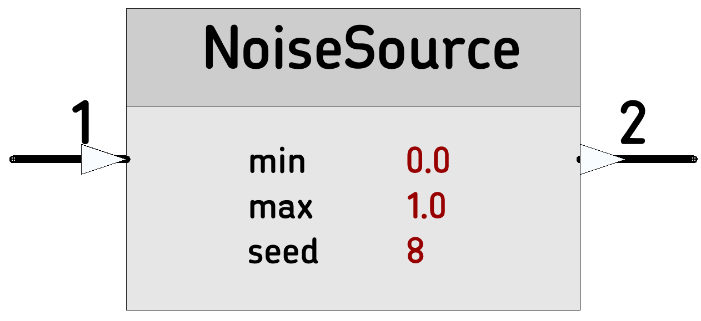

# [NoiseSource](https://github.com/nBlocksStudioApps/nblocks_noisesource) 

Generates pseudorandom values to be used as noise signal

----

----

 *  Category: Math
 *  HAL: No Hardware dependencies
 *  Status:  Node tested with LPC1768
 *  Author: Nikolaos Chalikias

## Implementation details 
Based on standard C library rand(), has zero ‘DC component (offset value = zero)

## Inputs/Outputs
 *  Any type: Input: Triggers Output
 *  float: Output: Pseudorandom value

## Parameters 
*  float: min: Minimum output value 
*  float: max: Maximum output value
*  uint32_t: seed: seed for the standard c-library function srad()

## Examples:
[Ticker]-->[NoiseSource]-->[StringFormat]-->[StringSerial]

[42D_KalmanSimple_test_FIRMWARE](https://github.com/nBlocksStudioApps/42D_KalmanSimple_test_FIRMWARE)